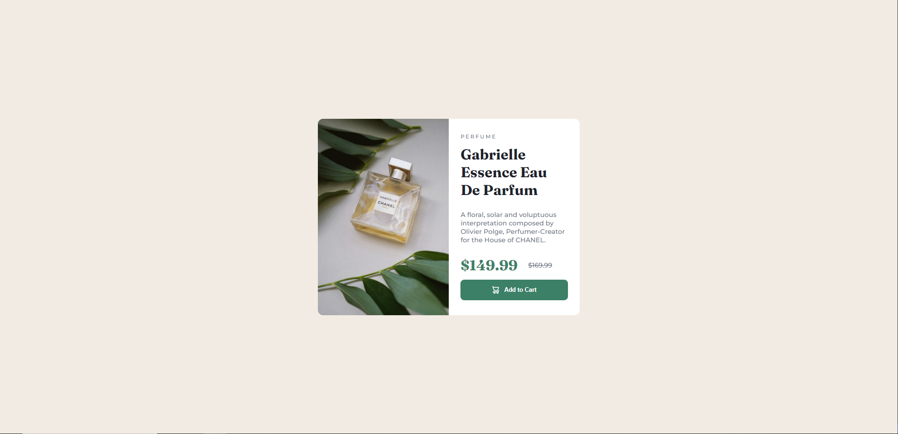

# Frontend Mentor - Product preview card component solution

This is a solution to the [Product preview card component challenge on Frontend Mentor](https://www.frontendmentor.io/challenges/product-preview-card-component-GO7UmttRfa). Frontend Mentor challenges help you improve your coding skills by building realistic projects.

## Table of contents

- [Overview](#overview)
  - [The challenge](#the-challenge)
  - [Screenshot](#screenshot)
  - [Links](#links)
- [My process](#my-process)
  - [Built with](#built-with)
  - [What I learned](#what-i-learned)
- [Author](#author)

## Overview

Building a product preview card, for desktop and mobile view.

### The challenge

Users should be able to:

- View the optimal layout depending on their device's screen size
- See hover and focus states for interactive elements

### Screenshot

### Links

[Solution URL](https://github.com/Antonvasilache/product-preview-card)
[Live Site URL](https://product-preview-card-av.netlify.app/)

## My process

1. Writing down the HTML structure and placing the content inside.
2. Adding css classes.
3. Adding flex and grid containers to center the content accordingly.
4. Formatting content with fonts and colors.
5. Adding spacing and border radius.
6. Formatting the button.
7. Changing the layout for mobile devices, using breakpoints.
8. Adding the active state.

### Built with

- Semantic HTML5 markup
- CSS custom properties
- Flexbox
- CSS Grid

### What I learned

- Using CSS Grid to center content to the viewport.
- Working with different fonts.
- Changing layouts at certain breakpoints.

## Author

- Website - [Antonvasilache.com](https://www.antonvasilache.com)
- Frontend Mentor - [@Antonvasilache](https://www.frontendmentor.io/profile/Antonvasilache)
